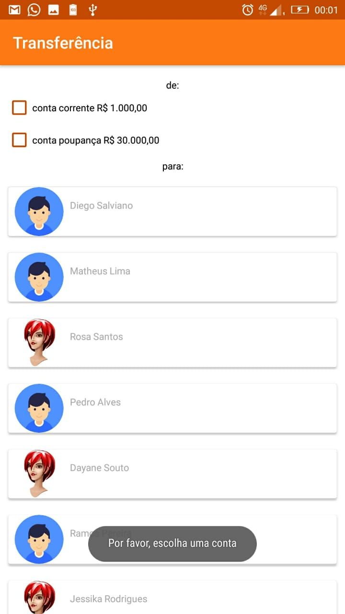
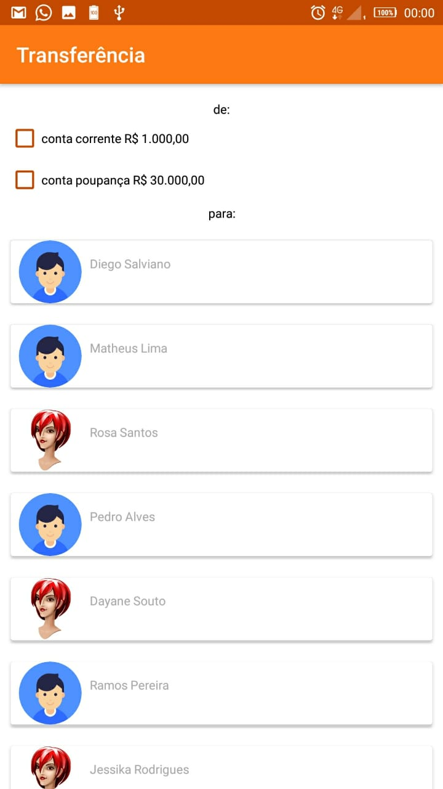
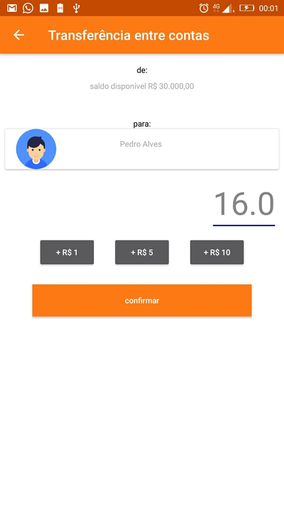

# Simulador de transferência

Consumindo um aquivo json hospedado em um servidor S3 AWS

## Instalação

Basta clonar o projeto, e executar 

## Utilização

Escolher uma conta para que possa fazer a transferência para um dos seus contatos 
```

## Bibliotecas

retrofit
gson
cardview
recyclerview
glide

URL: https://s3add.s3.us-east-2.amazonaws.com/user.json

telas
 ___  ___  ___ 
